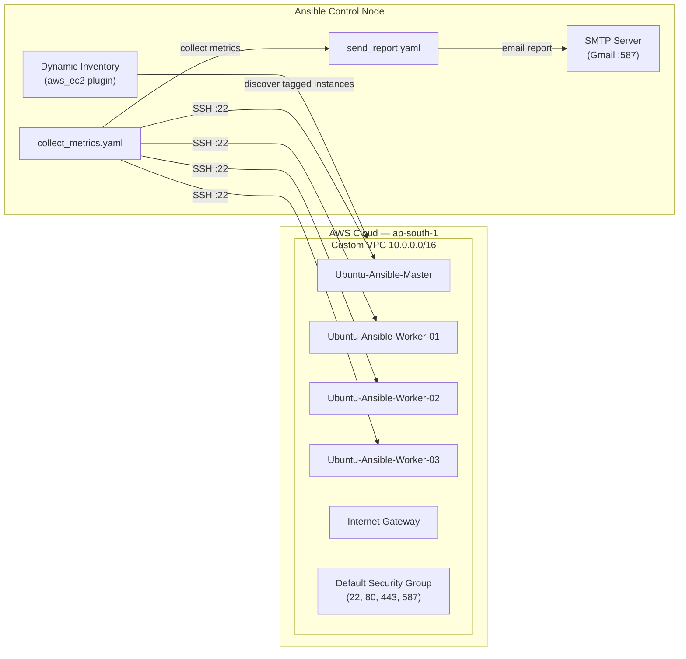
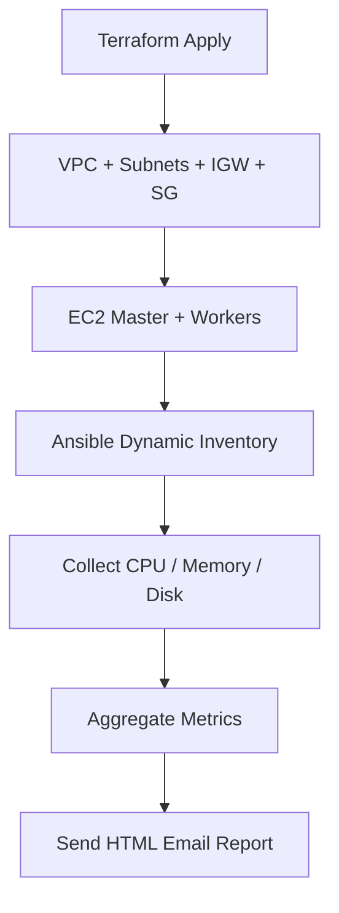
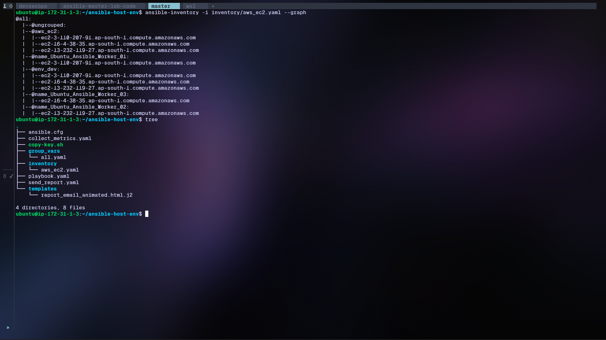
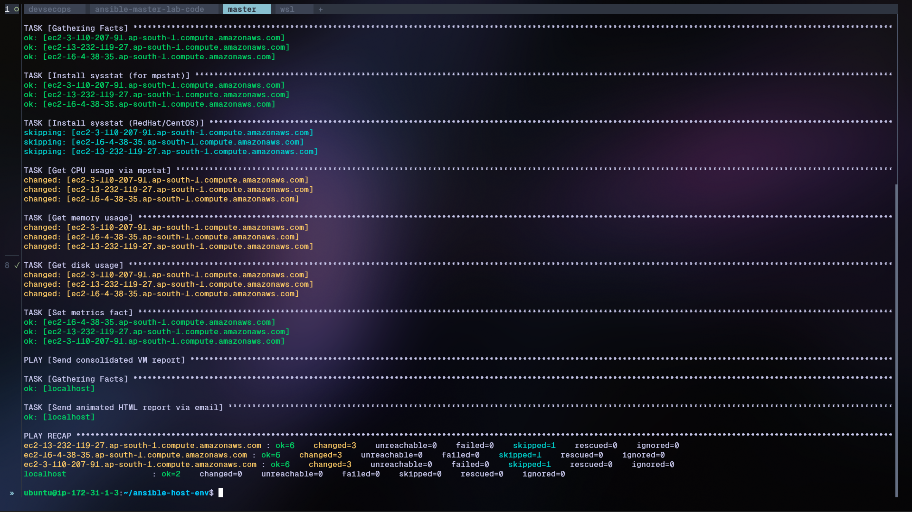
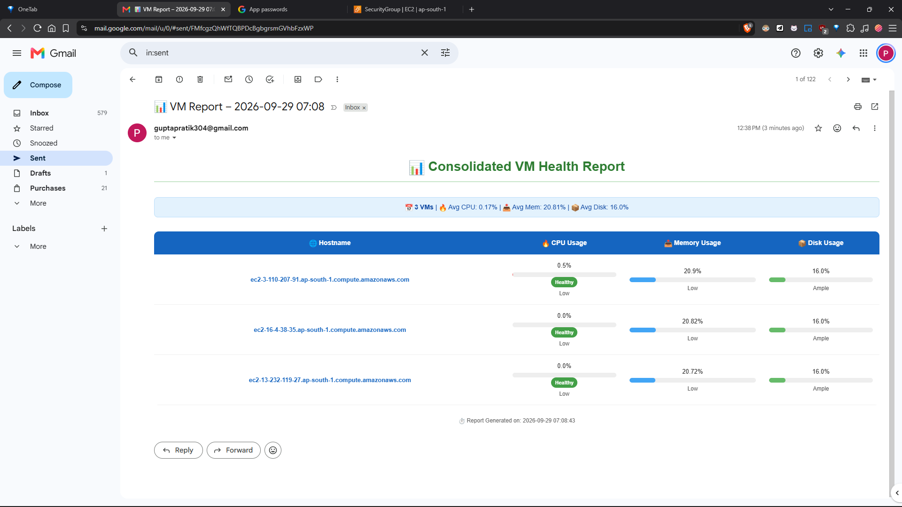

# Ansible — Multi-Server AWS Orchestration

This directory contains the Ansible automation layer for the **Terraform + Ansible Orchestration Lab**. After Terraform provisions AWS EC2 instances, Ansible takes over to dynamically discover those instances, collect system metrics (CPU, memory, disk), and email a consolidated HTML report — all without a static inventory file.

## How It Works





1. **Dynamic Inventory** — The `amazon.aws.aws_ec2` inventory plugin queries the AWS API in real time, filtering for running instances tagged `Environment: dev` in `ap-south-1`. No manual inventory maintenance.
2. **Metric Collection** — The `collect_metrics.yaml` playbook connects to every discovered host, installs `sysstat`, and captures CPU, memory, and disk usage.
3. **Email Report** — The `send_report.yaml` playbook aggregates all metrics and sends a styled HTML email via SMTP.

## Technology Stack

| Component | Version / Detail |
|-----------|-----------------|
| Ansible | 2.15+ (with `amazon.aws` collection) |
| Python | 3.10+ |
| AWS CLI | v2 |
| Terraform | 1.5+ (provisions the EC2 targets) |
| OS (targets) | Ubuntu 22.04 (Debian family) |

## Prerequisites

- **AWS Key Pair** — The `.pem` file used by Terraform must be copied to `~/.ssh/` on the Ansible control node.
- **SSH Key for Ansible** — A separate key pair generated on the control node to authenticate with the worker nodes.
- **AWS CLI** — Installed and configured with credentials that have `ec2:DescribeInstances` permission.
- **Ansible** — Installed with the `amazon.aws` collection.

## Setup & Configuration

### 1. Copy the AWS Key Pair

Place the `.pem` file used by Terraform into `~/.ssh/`:

```bash
# copy the pem file contents in my-key.pem then  
chmod 400 ~/.ssh/my-key.pem
```

### 2. Generate an Ansible Control-Node Key

This key will be injected into every worker node so Ansible can connect:

```bash
ssh-keygen -t ed25519 -f ~/.ssh/id_ed25519 -N ""
chmod 400 ~/.ssh/id_ed25519
```

### 3. Install Dependencies

```bash
# Install AWS CLI v2
ARCH=$(uname -m)
if [ "$ARCH" = "x86_64" ]; then 
    AWS_ARCH="x86_64"
elif [ "$ARCH" = "aarch64" ]; then 
    AWS_ARCH="aarch64"
fi

curl "https://awscli.amazonaws.com/awscli-exe-linux-${AWS_ARCH}.zip" -o "awscliv2.zip"
sudo apt-get install -y unzip
unzip awscliv2.zip
sudo ./aws/install --update
rm -rf aws awscliv2.zip
```

```bash
# Install Ansible
sudo apt update
sudo apt install software-properties-common -y
sudo add-apt-repository --yes --update ppa:ansible/ansible
sudo apt install ansible -y
```

### 4. Configure AWS Credentials

```bash
aws configure
# Enter: AWS Access Key ID, Secret Access Key, region (ap-south-1), output (json)
```

### 5. Update Group Variables

Edit `group_vars/all.yaml` with your SMTP and alert settings:

```yaml
smtp_server: "smtp.gmail.com"
smtp_port: 587
email_user: "your-email@gmail.com"
email_pass: "your-app-password"
alert_recipient: "recipient@example.com"
```

> **Note:** For Gmail, use an [App Password](https://support.google.com/accounts/answer/185833) — not your regular password.

### 6. Inject the Ansible Key into Worker Nodes

Run the helper script to push the control-node public key to all discovered instances:

```bash
chmod +x copy-key.sh
./copy-key.sh
```

## Project Structure

```
ansible/
├── ansible.cfg                  # Ansible configuration (inventory, SSH, interpreter)
├── playbook.yaml                # Entry point — imports collect + report playbooks
├── collect_metrics.yaml         # Collects CPU, memory, disk from all hosts
├── send_report.yaml             # Sends consolidated HTML email report
├── copy-key.sh                  # Helper: inject SSH key into worker nodes
├── inventory/
│   └── aws_ec2.yaml             # Dynamic inventory plugin config
├── group_vars/
│   └── all.yaml                 # SMTP credentials, alert recipient
└── templates/
    └── report_email_animated.html.j2   # Jinja2 HTML email template
```

## Usage

### Verify Dynamic Inventory

List all discovered hosts grouped by tags:

```bash
ansible-inventory -i inventory/aws_ec2.yaml --graph
```

Expected output:

```
@all:
  |--@env_dev:
  |  |--ip-10-0-1-10.ap-south-1.compute.internal
  |  |--ip-10-0-1-20.ap-south-1.compute.internal
  |--@name_web-server:
  |  |--ip-10-0-1-10.ap-south-1.compute.internal
  |--@name_app-server:
  |  |--ip-10-0-1-20.ap-south-1.compute.internal
  |--@ungrouped:
```

### Run the Full Playbook

```bash
ansible-playbook playbook.yaml
```

This executes both playbooks in sequence:

1. **`collect_metrics.yaml`** — Runs against `env_dev` group, installs `sysstat`, gathers CPU/memory/disk metrics.
2. **`send_report.yaml`** — Runs on `localhost`, aggregates all metrics, sends the HTML email.

### Run Individual Playbooks

```bash
# Only collect metrics
ansible-playbook collect_metrics.yaml

# Only send the report (uses cached facts from previous run)
ansible-playbook send_report.yaml
```

### Target a Specific Host or Group

```bash
# Run only against the web-server group
ansible-playbook collect_metrics.yaml --limit name_web_server

# Run against a single host
ansible-playbook collect_metrics.yaml --limit ip-10-0-1-10.ap-south-1.compute.internal
```

## Screenshots

### Dynamic Inventory Discovery



### Playbook Execution



### Email Report



## Key Features

- **Zero-touch inventory** — No static inventory files; hosts are discovered live from AWS tags.
- **Tag-based grouping** — Instances are automatically grouped by `Name` and `Environment` tags for targeted execution.
- **Idempotent key injection** — `copy-key.sh` safely appends the public key without overwriting existing entries.
- **Multi-distro support** — Metric collection handles both Debian (`apt`) and RedHat (`yum`) package managers.
- **Visual email reports** — Animated HTML template with per-host metric cards.
- **SSH pipelining** — Enabled in `ansible.cfg` for faster execution across many hosts.

## Troubleshooting

| Issue | Solution |
|-------|----------|
| `Failed to connect to the host via ssh` | Ensure the control-node SSH key has been injected via `copy-key.sh` and the security group allows SSH (port 22). |
| `Unable to fetch inventory` | Verify AWS credentials with `aws ec2 describe-instances --region ap-south-1`. |
| `mpstat: command not found` | The playbook installs `sysstat` automatically; ensure the host has internet access for `apt`/`yum`. |
| Email not received | Check SMTP credentials in `group_vars/all.yaml` and verify the App Password is correct. |
| `WARNING: REMOTE HOST IDENTIFICATION HAS CHANGED` | Set `host_key_checking = False` in `ansible.cfg` (already configured). |

## Security Notes

- **Never commit** `group_vars/all.yaml` with real credentials. Add it to `.gitignore` or use `ansible-vault`.
- The `ansible.cfg` disables host key checking for lab convenience. In production, manage `known_hosts` properly.
- Use IAM roles instead of access keys when running on an EC2 control node.
